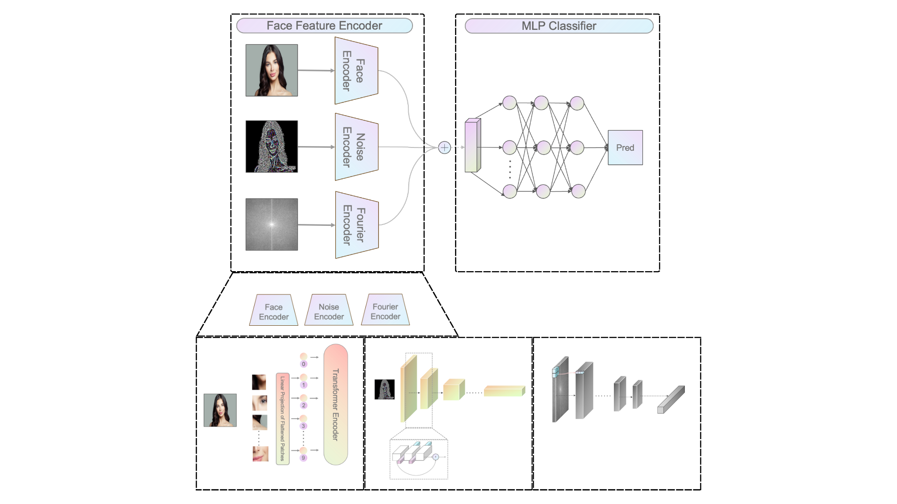

# Face Net: An AI-generated Face Detection Model Integrating Multiple Informatics Sources
The rapid advancement of generative AI in both image and text generation has captivated people with its astonishing capabilities. However, this progress also introduces a hidden security risk known as generative AI fraud. This form of fraud involves leveraging AI to create realistic faces and voices of individuals close to the victim, subsequently exploiting them through deceptive activities using videos or phone calls. It is of utmost importance for society to have a technology that can discern whether a face has been generated by AI. In this paper, we propose a deep learning framework that harnesses facial features, image noise, and the Fourier transform spectrum of an image to predict the authenticity of AI-generated face images. To assess the framework’s performance, we conduct training, validation, and testing using a comprehensive face dataset. Additionally, we incorporate a pure fake and real dataset to enhance the model’s decision-making process and increase its reliability. Furthermore, we employ varying levels of difficulty in our testing phase to evaluate the capability of model. Through our research, we aim to address the urgent need for an effective solution to detect AI-generated faces and mitigate the risks associated with generative AI fraud. The proposed deep learning framework presents a promising approach in safeguarding individuals and organizations from the potential harm caused by deceptive use of AI-generated images.


## Quick start
```bash
conda create --name facenet python=3.9
pip install -r requirements.txt
```
## Train models
```bash
python main.py
```

## Use pretrained model
You can download the pre-trained model in [here](https://drive.google.com/file/d/1AusHvpatUIXogsrs5o-6uuuCd-5qvR3b/view?usp=share_link)

## Run experiments
```bash
python experiments.py
```
